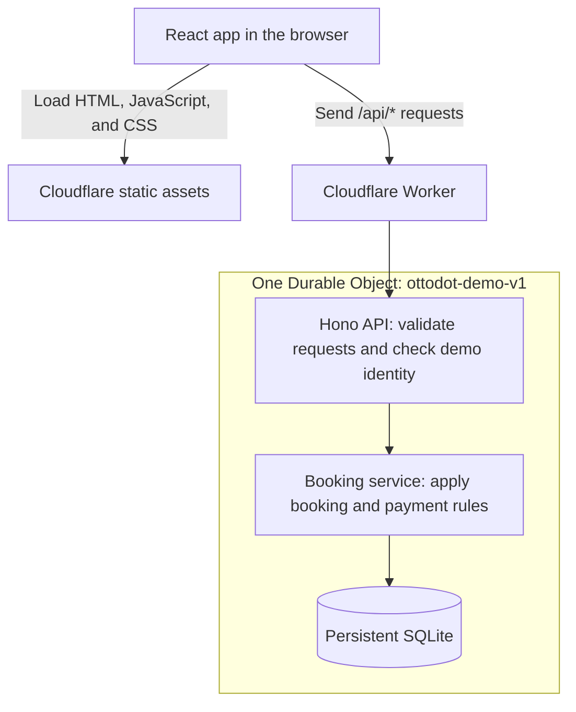

# Ottodot trial booking

A take-home project for booking children's trial classes. Parents choose a child and a class, try a mock payment, and see whether the booking is confirmed. Teachers can check who's coming, with a maximum of four children in each class.

The interesting part is what happens when two parents want the last seat. This project focuses on getting that right, along with duplicate bookings, failed payments, and retries after a lost response.

**[Open the live demo](https://ottodot-trial-booking.lina-duni.workers.dev)** · **[Watch the walkthrough · 6:47](https://ottodot-trial-booking.lina-duni.workers.dev/walkthrough.html)** · [How it works](#how-the-solution-works) · [Run locally](#run-locally) · [Deploy to Cloudflare](#cloudflare-deployment)

The walkthrough has generated English narration, captions, and chapter navigation. You can also [download the MP4 from GitHub](https://github.com/hbinduni/ottodot-trial-booking/releases/tag/walkthrough-v1) or [read the transcript](docs/narration.md). See [AI usage](AI_USAGE.md) for the disclosure.

## Try it out

You can open the demo without installing anything or signing in to Cloudflare. The families are made up, and the payment buttons simulate outcomes. No money moves.

1. Choose **Amy Chen** as the demo parent, then select **Ava**.
2. Find a class with room and click **Book trial**.
3. Try a successful or failed payment and read the result in the booking panel.
4. Open **My bookings** to revisit the payment history, or **Teacher roster** to see confirmed learners.

The public demo is shared, so another visitor may have already used a seat or booked a child. Use **Refresh** to pick up changes. For a repeatable walkthrough, run the app locally with the starting data described below.

## Run locally

You'll need [Bun](https://bun.sh/). The project was tested with **Bun 1.4.0**. SQLite runs inside the app, so there's no database server to set up.

From the repository root:

```sh
bun install --frozen-lockfile
bun run dev
```

Open [localhost:5173](http://localhost:5173). The API runs on [localhost:3000](http://localhost:3000/api/health). On first startup, the app creates `data/ottodot.sqlite` and adds the demo families and classes. Your bookings stay there when you restart.

To serve the built frontend and API together, stop the dev servers first, then run:

```sh
bun run build
bun start
```

Open [localhost:3000](http://localhost:3000). For a different database path, host, or API port, copy [.env.example](.env.example) to `.env` and adjust `DATABASE_PATH`, `HOST`, or `PORT`. The dev proxy uses the same API settings. The frontend dev server uses port 5173.

## Scenarios to explore

A fresh database includes these starting points:

| Try this | Starting data |
| --- | --- |
| Book a class with room | Space explorers has Mia confirmed, leaving three seats. |
| Compete for the last seat | Fun with fractions has Eli, Mia, and Zoe confirmed, leaving one seat. |
| Reopen an existing booking | Choose Sample family → Mia → Fun with fractions. You'll get the same confirmed booking. |
| Retry a failed payment | Amy's child Leo has a failed payment for Fun with fractions. Open the booking and try again. |
| Switch between families | Amy has Ava and Leo; Ben has Noah. |

Class dates are set seven and eight days ahead when the database is first seeded. They don't move forward on restart or redeployment.

To start over locally, stop the app and run:

```sh
bun run seed --reset
bun run dev
```

`--reset` deletes the demo records in your configured local database and recreates the starting data. It doesn't reset Cloudflare. Reload any open browser tabs afterward. Running `bun run seed` without `--reset` keeps existing records.

### See the last-seat case

Start with a fresh local database and open two tabs:

1. In tab A, choose **Amy → Ava** and book **Fun with fractions**. Leave the payment pending.
2. In tab B, choose **Ben → Noah** and book the same class.
3. Complete a successful mock payment in tab B. Noah's booking becomes `confirmed`.
4. Complete a successful mock payment in tab A. Ava's booking becomes `refund_required`, with reason `class_full`.
5. Open **Teacher roster → Fun with fractions**. There are four children, including Noah and excluding Ava.

Opening checkout doesn't hold a seat. The first successful payment transaction to claim the remaining seat wins. The other booking records that a refund is needed; it does **not** claim a refund has been issued.

## How the solution works

The browser lets a parent choose a child, open a booking, and submit a mock payment. The server decides whether that payment can confirm a seat. Teachers see the confirmed bookings through a roster query, so there's no separate roster record or background sync to maintain.

### How the pieces fit together

The app uses React and Vite for the frontend, Hono for the API, and SQLite for storage. This is the deployed Cloudflare path:



Every parent's API requests reach the same named Durable Object. It owns the database for all demo classes, which gives competing payments one shared place to check and claim seats. The Worker routes requests; the booking rules run inside the Durable Object.

Locally, Bun runs the same Hono API and booking service against a SQLite file. A small storage interface lets the service use Bun's SQLite connection or Cloudflare's storage adapter. Both versions share the SQL schema and business rules; they have separate databases.

### From choosing a class to joining the roster

1. **Load the available choices.** React calls `GET /api/bootstrap` for the demo families, children, and classes, and loads the selected parent's bookings. The displayed seat count is a snapshot; the server checks availability again when handling a booking or payment.
2. **Create or reopen a booking.** Clicking **Book trial** opens an existing booking if the browser already knows about it. Otherwise, it sends the child and class IDs to `POST /api/bookings`. The server checks ownership and returns any existing child/class booking. For a new booking, it rejects a full or started class, then creates `pending_payment`. This doesn't reserve a seat.
3. **Submit a mock payment.** The parent chooses success or failure. The browser saves a unique request key and the chosen outcome before calling `POST /api/bookings/:id/payments`. The selected demo parent travels in `X-Demo-Parent-Id`; the request key travels in `Idempotency-Key`.
4. **Decide the booking result atomically.** In one database transaction, the service handles replays, checks the booking and class, and saves the payment attempt alongside the new booking status. A failed payment leaves no seat allocated. A successful payment confirms the booking only if a seat is still available and the class hasn't started; otherwise, it records a refund obligation.
5. **Show what the server saved.** The payment response includes the booking, the recorded attempt, and whether this was a replay. React shows that result and refreshes availability and booking details. Opening **Teacher roster** queries only `confirmed` bookings. Another tab sees changes when it loads or refreshes its data.

### What is stored

| Record | Its role |
| --- | --- |
| `parents` and `students` | Connect each child to the parent who can manage their bookings. |
| `trial_classes` | Store the class title, subject, start time, and capacity of four. |
| `bookings` | Connect one child to one class and store the current booking status. |
| `payment_attempts` | Keep each payment key, mock outcome, resulting status, and any refund reason. A booking can have several attempts after failures. |

Keeping payment history separate from the current booking explains both **what happened to each request** and **whether the child has a seat now**. Availability is calculated from confirmed bookings, rather than a separate seat counter that could drift out of sync.

### Booking states

| Status | On the roster? | What it means |
| --- | --- | --- |
| `pending_payment` | No | The booking exists, but no seat is held. |
| `payment_failed` | No | The payment failed. Retry this booking with a new payment key. |
| `confirmed` | Yes | The child has a seat. New payment attempts are rejected. |
| `refund_required` | No | A successful payment arrived after the class filled up or started. A refund is needed but hasn't been issued. |

There is one booking per child and class, across all statuses. Clicking **Book trial** again returns that booking, including after a failed payment. A new payment attempt is attached to that booking; replaying the same request doesn't add another attempt. Confirmed and refund-required bookings are final and don't accept new payments.

### Keeping the last seat safe

The capacity check and payment record happen in one synchronous transaction. Bun uses `BEGIN IMMEDIATE`; Cloudflare uses `storage.transactionSync`.

Within that transaction, the service:

1. Checks that the booking belongs to the selected parent.
2. Looks for an existing payment key and handles a replay or conflicting request.
3. Rejects new payments on a final booking.
4. Checks the class start time against the server clock and counts remaining seats.
5. Updates the booking and saves the payment attempt together.

If saving the attempt fails, the booking update rolls back too. A successful payment only confirms a seat if the class hasn't started and still has room. Otherwise, it records `refund_required` with the appropriate reason.

The database also enforces the rules. Unique constraints prevent duplicate child/class bookings and payment keys. Foreign keys keep records connected, and triggers reject a fifth confirmed child even if a future writer bypasses the service. Roster rows and their count are read from the same transaction snapshot.

The tradeoff is that SQLite serializes writes. The local app must share one database file, and all Cloudflare requests must use the same Durable Object. Splitting storage by parent would let different families claim the same seat.

### Retrying without another payment attempt

Every mock payment request needs an `Idempotency-Key`. Sending the same key with the same booking and outcome returns the stored attempt. Reusing it with different input returns a conflict.

A replay returns **the original payment attempt and the current booking**. For example, an old failed attempt stays failed in the history even if a later retry has confirmed the booking.

Before sending a payment, the browser saves its key and intended outcome in `sessionStorage`. If the response is lost, you can reload and retry that request with its original key. Choosing to try again after a known payment failure uses a new key.

The Bun connection uses foreign keys, WAL mode, and a five-second busy timeout. If the database remains locked, the API returns `503` with `Retry-After: 1`; retry a payment with the same key. Cloudflare manages its own SQLite connections and serializes synchronous work within the Durable Object.

The transaction behavior follows the [Bun SQLite](https://bun.com/docs/runtime/sqlite#transactions) and [Cloudflare SQLite](https://developers.cloudflare.com/durable-objects/api/sqlite-storage-api/) APIs.

### Where to look in the code

| Start here | What you'll find |
| --- | --- |
| [ParentBooking.tsx](web/ParentBooking.tsx) and [PaymentPanel.tsx](web/PaymentPanel.tsx) | The parent flow, payment submission, and recovery after a lost response. |
| [TeacherRoster.tsx](web/TeacherRoster.tsx) | The teacher's view of confirmed learners. |
| [app.ts](server/app.ts) | HTTP routes, request validation, demo identity checks, and error responses. |
| [bookings.ts](server/bookings.ts) | The booking rules, payment transaction, idempotent replay, and roster queries. |
| [schema.sql](server/schema.sql) | Tables, unique constraints, and capacity and booking-state triggers. |
| [server/index.ts](server/index.ts) and [database.ts](server/database.ts) | The local Bun server and SQLite setup. |
| [cloudflare/index.ts](cloudflare/index.ts) and [sql-database.ts](cloudflare/sql-database.ts) | Worker routing, Durable Object initialization, and the Cloudflare storage adapter. |
| [concurrency.test.ts](tests/concurrency.test.ts) and [test-cloudflare.ts](scripts/test-cloudflare.ts) | Evidence for the last-seat race and payment replays across both runtimes. |

## API at a glance

API responses are JSON. Parent-specific routes use `X-Demo-Parent-Id`, such as `parent-amy`. This selects a demo identity; it isn't real authentication. The teacher roster is also public in this demo.

| Method and path | What it does |
| --- | --- |
| `GET /api/health` | Checks that the API can query the database. |
| `GET /api/bootstrap` | Returns the demo parents, children, and classes. |
| `GET /api/classes` | Returns class availability. |
| `POST /api/bookings` | Creates or reopens a booking. Body: `{ "studentId": "student-ava", "classId": "class-space" }`. |
| `GET /api/bookings` | Lists the selected parent's bookings. |
| `GET /api/bookings/:id` | Returns an owned booking and its payment history. |
| `POST /api/bookings/:id/payments` | Records `{"outcome":"succeeded"}` or `{"outcome":"failed"}`. Requires `Idempotency-Key`. |
| `GET /api/classes/:id/roster` | Returns confirmed children and the class count. |

A new booking returns `201`; reopening one returns `200`. Recording a payment also returns `200` when a refund is needed, so callers must read `booking.status` to know the outcome.

Errors use `{ "error": { "code": "...", "message": "..." } }`. Invalid input returns `400`, a missing or unknown demo parent `401`, an unknown or another parent's resource `404`, a conflict `409`, and a body over 8 KiB `413`. Conflicts include full or started classes, mismatched payment keys, and new payments on final bookings.

## Run the checks

```sh
bun run check                    # lint, types, SQLite tests, and frontend build
bun run demo:race                # run the ordered two-parent last-seat example
bun test tests/concurrency.test.ts
bun run test:cloudflare          # test the app in the local Cloudflare runtime
```

The race demo and tests use temporary databases, leaving your development data alone.

The Bun concurrency tests start eight separate processes against one SQLite file and release them together. They require exactly one last-seat winner and seven refund obligations. Another test sends five copies of one payment request and checks that only one attempt is stored.

The tests also cover failed-payment retries, duplicate bookings, ownership checks, invalid input, full and started classes, database constraints, lock contention, and rollback after a forced payment-recording failure. The Cloudflare suite checks the same critical flows in workerd and restarts the runtime to check persistence.

[Verification notes](docs/verification.md) record the results and browser checks, including recovery after a payment response was deliberately dropped. Those browser checks are documented development checks; they aren't yet a committed end-to-end test suite.

## Cloudflare deployment

### Open the app or manage its deployment

- **[Live app](https://ottodot-trial-booking.lina-duni.workers.dev):** open it directly. No Cloudflare account is needed.
- **[API health](https://ottodot-trial-booking.lina-duni.workers.dev/api/health):** a healthy response is `{"status":"ok","mode":"synthetic-demo"}`.
- **[Cloudflare dashboard](https://dash.cloudflare.com/):** sign in to the owning account and go to **Workers & Pages → ottodot-trial-booking → Deployments** to see versions and their share of traffic.

### Deploy it yourself

Alongside Bun, you'll need Node.js for Wrangler and permission to deploy Workers and SQLite Durable Objects in your Cloudflare account. This setup was tested with **Bun 1.4.0** and **Node.js 24.20.0**.

Run these commands from the repository root:

```sh
bun install --frozen-lockfile

# Sign in through your browser, then check which account you're using.
env -u CLOUDFLARE_API_TOKEN -u CLOUDFLARE_ACCOUNT_ID bunx wrangler login
env -u CLOUDFLARE_API_TOKEN -u CLOUDFLARE_ACCOUNT_ID bunx wrangler whoami

# Replace this with the account ID returned by whoami.
export CLOUDFLARE_ACCOUNT_ID='<your-account-id>'

bun run check
bun run test:cloudflare
env -u CLOUDFLARE_API_TOKEN bun run deploy:cloudflare
```

The `env -u` commands prevent an existing API token from overriding your browser login. You can reuse that login for later deployments; sign in again if it expires.

The deploy script builds the frontend, uploads the Worker and static files, and sets up the SQLite Durable Object defined in [wrangler.jsonc](wrangler.jsonc). Wrangler prints the public URL and Version ID when it's done. If you deploy to another account, the workers.dev subdomain will be different.

For an update, run the checks and the same deploy command. Keep the Worker name, Durable Object class, and object name unchanged to retain bookings. Pushing to GitHub alone doesn't deploy the app. More detail is in the [Cloudflare runbook](docs/cloudflare.md).

### Check which version is live

With your account selected as above:

```sh
env -u CLOUDFLARE_API_TOKEN bunx wrangler deployments list --name ottodot-trial-booking
env -u CLOUDFLARE_API_TOKEN bunx wrangler versions view '<version-id>' --name ottodot-trial-booking
```

Replace `<version-id>` with a version from the deployment list. The latest deployment shows which version is serving traffic. Cloudflare's Version ID is separate from a Git commit SHA. The [deployment receipt](docs/cloudflare.md#deployment-receipt-8-september-2026) records what was verified for this submission; Cloudflare's [versions guide](https://developers.cloudflare.com/workers/versions-and-deployments/) explains the dashboard view.

To preview the Cloudflare version locally, run `bun run dev:cloudflare` and open the URL Wrangler prints.

## What would change for a real product?

The payment endpoint is a mock command. It can record a payment outcome and allocate a seat in one database transaction because it doesn't contact a payment provider. A real charge can't be made atomic with this SQLite transaction.

A production payment flow would need provider idempotency keys, signed event verification, amount and currency checks, durable event deduplication, and an outbox for refund work. A late or duplicate event describing an actual charge still needs reconciliation, even if the booking is already final. The mock's rule for rejecting a new payment command isn't sufficient for a real webhook.

Allocating seats at confirmation avoids abandoned seat holds and expiry jobs, but it means a parent can pay after the class fills. Temporary holds or authorization followed by capture could improve that experience, with extra work for expiry and late events.

This slice also leaves out real parent/teacher authentication, cancellation, re-enrollment, refund execution, emails, background jobs, and regular enrollment. There's no pagination or automatic polling; use **Refresh** when another tab changes a booking.

The next priorities would be authenticated roles, payment reconciliation and refund processing, and automated browser recovery tests. At higher write volume, PostgreSQL with a lock on the relevant class row would allow unrelated classes to handle payments concurrently. Useful operational signals would include unresolved refunds, payment/booking mismatches, capacity violations, lock timeouts, and latency.

## Project notes

The project was built with substantial AI assistance. [AI_USAGE.md](AI_USAGE.md) explains what Codex helped with, the candidate's decisions, and corrections made during review.

Active work was estimated at **about two and a half hours** across implementation, UI changes, tests, documentation, video preparation and publishing, and deployment on 7–8 September 2026. This excludes idle time and candidate review; it isn't a precise time log. Further review and editing count toward the task's four-hour cap.

The [video walkthrough](https://ottodot-trial-booking.lina-duni.workers.dev/walkthrough.html) loads its MP4 from a public [GitHub Release](https://github.com/hbinduni/ottodot-trial-booking/releases/tag/walkthrough-v1). The release also includes captions and checksums. The [walkthrough guide](docs/walkthrough.md) includes questions to rehearse and notes for recording your own narration.
